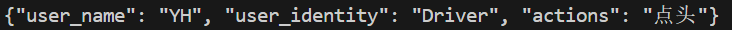
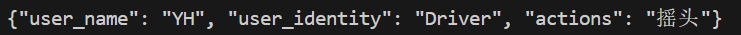

# 人脸识别系统设计与实现报告

## 1. 运行环境

本系统运行于 **Python 3.9.8** 环境，主要依赖以下第三方库：

- `opencv-python`
- `numpy`
- `insightface`
- `mediapipe`

安装方式如下：

```bash
pip install opencv-python numpy insightface mediapipe
```

本地测试时使用 CPU 环境进行测试，避免因显卡驱动问题导致模型初始化失败。若需 GPU 加速，请配置 `insightface` 支持 CUDA 的运行环境。

此外，需要将insightface使用的buffalo_l模型文件提前下载、解压到用户目录下(下载链接见readme.md，文件放置位置见代码目录下的txt说明文件)。

---

## 2. 系统设计思路

本系统以实时人脸识别为核心，结合深度特征提取和人脸行为监测两个维度进行综合判断。设计中分为以下几个子模块：

1. **模型加载模块**：使用 `insightface` 的 `buffalo_l` 模型进行人脸检测和 embedding 提取。
2. **数据库模块**：使用 `.npy` 文件格式持久化存储人脸数据库，按人名存储身份信息、多个 embedding，并计算平均特征。
3. **人脸注册模块**：通过摄像头采集多个图像，并自动生成 embedding，注册至数据库。
4. **识别模块**：实时采集图像，对当前人脸进行识别并输出识别结果。
5. **行为检测模块**：通过 MediaPipe 检测点头摇头、长时间闭眼和频繁东张西望行为。


整体逻辑如下图所示：

```
摄像头输入(或通过视频文件模拟) → MediaPipe初步人脸识别 → InsightFace 人脸编码 → 数据库比对 → 显示身份
                                                    ↘
                                                        MediaPipe 行为分析 → 状态判断输出
```

---

## 3. 系统详细设计

### 3.1 模型初始化与全局参数设置

```python
model_app = FaceAnalysis(name="buffalo_l", providers=['CPUExecutionProvider'])
model_app.prepare(ctx_id=0, det_size=(640, 640))  # 自动检测 + 对齐

face_detection = mp.solutions.face_detection.FaceDetection(min_detection_confidence=0.9)
face_mesh = mp.solutions.face_mesh.FaceMesh(refine_landmarks=True)
```

- 使用 `insightface` 提供的人脸分析模型，自动完成人脸检测与对齐；
- 使用 `MediaPipe` 提供的人脸网格点检测模型，提取眼部与鼻梁位置，用于行为识别。

### 3.2 人脸注册模块

```python
def register_face(cap, capture_count=10):
    ...
    while len(embeddings) < capture_count:
        ret, frame = cap.read()
        ...
        emb = get_embedding(frame)
        if emb is not None:
            embeddings.append(emb)
    ...
    db[name] = {
        'identity': identity,
        'embeddings': embeddings,
        'mean_emb': np.mean(embeddings, axis=0)
    }
```

- 每次采集图像后使用模型提取 embedding；
- 至少采集 `capture_count`（默认10）张图片以提高准确性；
- 生成的特征值保存在 `.npy` 格式数据库文件中。既保存了原始采样的每张人脸的特征，又计算了平均人脸特征、进行保存
- identity表示注册用户的身份，只接受"Passenger" or "Driver"。 用户提前进行身份绑定，录入数据库；实际开发中，需要检测人脸位置、动态判定角色，这里作个简化，分别录入以模拟功能。

### 3.3 人脸识别模块
核心代码如下，其中`get_embedding`封装了对buffalo_l的特征提取函数，这里不作展示。
```python
def recognize_face(cap):
    db = load_database()
    ...
    emb = get_embedding(frame)
    ...
    # 寻找对应用户
    if emb is not None:
        candidates = []
        for name, data in db.items():
            # 策略1：与平均向量比较
            mean_dist = np.linalg.norm(emb - data['mean_emb'])
            # 策略2：历史最小距离
            min_dist = min([np.linalg.norm(emb - sample) for sample in data['embeddings']])
            # 综合评分（可调整权重）
            score = 0.6*mean_dist + 0.4*min_dist
            candidates.append((score, name))
        
        # 默认为Unknown(即数据库为空，一定是Unknown)
        identity_name = "Unknown"
        # 找出最佳匹配
        if candidates:
            best_score, best_name = min(candidates, key=lambda x: x[0])
            identity_name = best_name if best_score < identity_threshold else "Unknown"
```
下面对我们的代码作出解释。
- 总体识别逻辑为，计算当前视频帧中的人脸和数据库中的人脸编码向量的距离，若距离小于一定阈值则认为二者是同一张人脸。
- 具体计算方法：枚举数据库中的每张人脸数据，计算采用欧几里得距离，且使用**加权计算的方式**，对枚举人脸的平均值距离、原始样本最小距离分别计算，最终计算出数据库中每张人脸的得分。
- 阈值控制识别精度，`identity_threshold` 越小则要求越高。若距离大于设置阈值，则认为数据库中的人脸和检测对象均不相似，标记为`Unknown`。

### 3.4 行为识别模块:异常状态检测
该模块用于实现基于人脸关键点的短时行为识别功能，能够检测“长时间闭眼”和“持续东张西望”两类驾驶员异常状态。识别逻辑基于 MediaPipe 的面部关键点（landmarks）进行推断，并结合滑动窗口进行稳定性判断和冗余信号抑制。

以下为核心代码及解释：
```python
# 闭眼检测
def is_eye_closed(box, landmarks, side='left'):
    if side == 'left':
        top, bottom = landmarks[159], landmarks[145]
    else:
        top, bottom = landmarks[386], landmarks[374]
    return abs(top.y - bottom.y) * 270 < 0.007 * abs(box[3] - box[1])
```
`is_eye_closed` 用于判断左或右眼是否闭合。MediaPipe 提供的 468 个面部关键点中，点 159/145 对应左眼上/下眼睑，386/374 对应右眼。函数通过比较上下眼睑的纵向**相对**距离是否小于阈值（0.015）来判断闭眼，适用于不同分辨率下的面部缩放情况。

**要求中让判断目光集中在哪里，我们分析之后觉得就是在判断注意力是否集中，认为闭眼检测更合理，实现起来也更简单，用这个作替代。**


```python
# 东张西望检测
def is_looking_side(box, landmarks):
    left_eye, right_eye, nose = landmarks[33], landmarks[263], landmarks[1]
    dx = abs(left_eye.x - right_eye.x)
    dn = abs(nose.x - (left_eye.x + right_eye.x) / 2)
    return (dn / dx) > 0.08
```
`is_looking_side` 判断用户是否存在东张西望行为。原理为：当鼻尖（点 1）偏离双眼连线中点超过一定比例（dn/dx > 0.08）时，认为用户可能在左右频繁观察。该方法具有良好的鲁棒性，可适应轻微头部转动。


```python
def monitor_behavior(landmarks, frame):
    global last_eye_time, last_lkside_time
    current_time = time.time()

    left_closed = is_eye_closed(landmarks, 'left')
    right_closed = is_eye_closed(landmarks, 'right')
    EYE_CLOSED_BUFFER.append(left_closed and right_closed)

    LOOKING_SIDE_BUFFER.append(is_looking_side(landmarks))
```
主函数 `monitor_behavior` 每帧被调用，接收面部关键点和图像帧。函数维护两个滑动窗口 `EYE_CLOSED_BUFFER` 和 `LOOKING_SIDE_BUFFER`，分别记录最近 N 帧中闭眼和东张西望的布尔判断，用于后续行为趋势分析。

- 若在滑动窗口内有超过 70% 的帧判断为双眼闭合，则触发“长时间闭眼”提示，同时在图像上叠加警告文字。
```python
if sum(EYE_CLOSED_BUFFER) / len(EYE_CLOSED_BUFFER) > 0.7:
```
- 东张西望判断逻辑与闭眼相似，使用独立滑动窗口并设定阈值 60%，当在窗口内东张西望行为占比超过此值时判定为“持续东张西望”。
```python
if sum(LOOKING_SIDE_BUFFER) / len(LOOKING_SIDE_BUFFER) > 0.6:
```
- 最终返回结果为对各个行为的检测结果字符串拼接。
```python
# 状态监测
return "无明显行为" if action_str_list == [] else ", ".join(action_str_list)
```

### 3.5 行为识别模块:点头摇头检测
点头摇头检测和前文所述不同，前文所说的异常状态检测本质上是记录的若干个帧的静态信息，根据异常状态占比来进行判断。

点头摇头则需要记录“动态”的信息，实现起来会稍微复杂一些，即每次记录的是帧之间的变化，通过鼻尖**变化幅度**来判断是否进行点头或者摇头动作。

无论点头还是摇头，都是一个“上上下下”或“左左右右”的过程，因此还需要根据每次的变化方向(只接受超过一定幅度的变化)来判断是否完成一次完整的点头/摇头过程。

代码如下：
```python
NOD_BUFFER = deque(maxlen=5)  # 存储y轴运动趋势
SHAKE_BUFFER = deque(maxlen=5)  # 存储x轴运动趋势

# 获得鼻尖运动趋势, 计算运动位移
def update_head_movement_buffer(landmarks):
    # 只使用鼻尖判断
    nose = landmarks[1]

    # 只用鼻尖也可以：更敏感
    y_pos = nose.y
    x_pos = nose.x

    # 记录连续帧的变化趋势
    if not hasattr(update_head_movement_buffer, "last_y"):
        update_head_movement_buffer.last_y = y_pos
        update_head_movement_buffer.last_x = x_pos

    dy = y_pos - update_head_movement_buffer.last_y
    dx = x_pos - update_head_movement_buffer.last_x

    # 更新缓冲区
    NOD_BUFFER.append(dy)
    SHAKE_BUFFER.append(dx)

    update_head_movement_buffer.last_y = y_pos
    update_head_movement_buffer.last_x = x_pos

def is_nodding(box):
    # 点头检测：Y方向有明显的上-下-上或下-上-下的震荡（变化方向切换次数 > 1）
    trend = [1 if dy > 0 else -1 for dy in NOD_BUFFER if abs(dy) * 270 > 0.02 * abs(box[3] - box[1])]
    changes = sum(1 for i in range(1, len(trend)) if trend[i] != trend[i-1])
    return changes >= 2

def is_shaking(box):
    # 摇头检测：X方向有明显的左-右-左或右-左-右的震荡
    trend = [1 if dx > 0 else -1 for dx in SHAKE_BUFFER if abs(dx) * 270 > 0.02 * abs(box[2] - box[0])]
    changes = sum(1 for i in range(1, len(trend)) if trend[i] != trend[i-1])
    return changes >= 2
```
每次在monitor_behavior中调用一次update，计算变化值，再对nodding和shaking分别判断即可。

仍然需要注意，此处使用的应当是相对值，否则隔得远隔得近会有区别(虽然正常来说车载摄像头的距离是一定的)。

### 3.6 信息传递处理

#### 信息存储设计
我们的代码逻辑是实时对视频帧进行处理，即while循环中以非常高的频率进行人脸检测。

运行过程中，一共有三类信息需要传递给主控模块(以高频率传递给主控模块)：
- 用户姓名信息: 我们设定用户类型有三类:
    - "None", 表示摄像头中没有检测到用户人脸。
    - "Unknown", 表示摄像头中检测到人脸，但不在数据库中定义。
    - 其它类型，即数据库中的定义记录的人名。
    - 保证了注册时人名不能出现重叠、不能为"None"和"Unknown"。

- 用户角色信息: 我们设定用户角色有4类。和用户姓名信息有一定对应关系:
    - "None", 当且仅当摄像头中没有检测到用户人脸，即用户姓名信息为"None"时。
    - "Unregistered Role", 当且仅当用户姓名信息为"Unknown"时。
    - "Passenger" or "Driver": 用户提前进行身份绑定，录入数据库(实际开发中，需要检测人脸位置、动态判定角色，这里作个简化，分别录入以模拟功能)。

```python
    # 根据记录的用户信息给出记录的身份结果
    if record_name == 'Unknown':
        record_role = "Unregistered Role"
    elif record_name == "None":
        record_role = "None"
    else:
        record_role = db[record_name]['identity']
```

- 用户行为信息
    - 闭眼检测。具体检测逻辑在上面已经说得很清楚了。
    - 持续东张西望检测。具体检测逻辑在上面已经说得很清楚了。
    - 点头/摇头。具体检测逻辑在上面已经说得很清楚了。

所有信息被打包封装成一个json格式的数据，一起发送给后续模块作处理。
```python
"""
{   
    "user_name": str
    "user_identity": str
    "actions": str
}
"""
```

#### 用户信息更改

因为转头等动作时会出现短暂的识别为“unknown”(多角度人脸识别问题，没有太好的办法解决)，如果识别到“unknown”立刻就将user信息更新为“未知用户”，可能会出现用户在做出动作时，用户信息频繁在真实身份和“未知用户”之间横跳的情况。

本质是因为角度过大时，人脸编码和已有数据距离过大导致的。

为了解决这个问题，我们将“记录身份”和“识别身份”作出一定的区分，设置这样的逻辑:
- **记录**的用户身份试图从“有数据用户”变更为“未知用户”时，必须满足之前连续若干帧都**识别**为“未知用户”。
    - 用一个队列记录**识别**结果。
    - 相当于为有记录用户延续了身份的记录信息，避免因为短暂的动作导致错误的编码和识别。

- 其它情况下，**记录**的用户身份直接更新为新的**识别**用户。下面作出一定的解释。
    - 如果变更对象是“未知用户”，变更前是“None”或者“未知用户”，也需要直接修改。后者很显然无所谓，前者则是因为识别到了人脸，代表有用户存在了，需要立刻变更。
    - 如果变更对象是“None”，不管之前是什么对象，都直接变更，因为Mediapipe判断有没有人脸还是比较准确的，出现这个结果代表没有识别到人脸。
    - 如果变更对象是“有数据用户”，不管之前是什么对象，都直接变更，因为buffalo_l**说你没有记录不代表你没有记录，但说你有记录是代表人脸距离是真小、真有记录。**

对应代码如下:
```python
    # 根据本次识别信息，修改记录信息
    # 如果是注册用户到Unknown:
    if record_name != "None" and record_name != "Unknown" and identity_name == "Unknown":
        # 连续若干帧识别为Unknown才修改记录信息, 否则保持不动
        if sum(IDENTITY_BUFFER) == len(IDENTITY_BUFFER):
            record_name = "Unknown"
    else:
        record_name = identity_name

    # 记录之前识别的信息是不是Unknown
    IDENTITY_BUFFER.append(identity_name == "Unknown")
```

---

## 4. 数据库设计

数据库文件为 `face_db.npy`，格式为 Python 字典结构，内容示例如下：

```python
{
  "张三": {
    "identity": "Driver",
    "embeddings": [embedding1, embedding2, ..., embedding10],
    "mean_emb": mean_vector
  },
  ...
}
```

- 所有数据通过 `numpy.save` 持久化；
- 每个用户对应一组原始 embedding 和一个平均 embedding；
- 识别过程中同时使用到平均值和原始向量。
    - 平均值反映了“人脸”的整体特征。
    - 计算原始向量中的每个向量和检测对象向量的最小距离，是为了防止采样角度的不同导致平均向量“走样”、最后计算出来的差异过大。此外，这也可以一定程度上解决**多角度人脸检测**的难题。

---

## 5. 系统测试

### 5.1 功能测试

#### 测试数据集

- 共使用 4 个视频来模拟实时摄像头(循环播放)：
  - 视频均使用手机摄像头拍摄, 帧率为30fps。
  - 因为某些原因(在下面有说明)，视频帧率不能过高，因此我们作出跳帧处理: 。
  - register_user1/2.mp4：用于注册数据库中的两个用户；
  - test_user.mp4：两个用户轮流出现在画面中，用于测试代码的用户识别能力。
  - test_action.mp4：同一个人分别执行长时间闭眼与持续东张西望、点头摇头，用于测试代码的行为分析能力。

#### 测试结果

1. **人脸识别功能**：
    - 正常正脸情况下均能正确识别；
    - 偏头或光照不足时偶有误识别（Unknown / None）。
    - 多角度人脸识别始终是难题，Mediapipe提供的模型虽然快，但对于轻微的角度偏转几乎无法识别；我们使用buffalo_l模型，以牺牲一部分性能为代价，提供了相对精准的多角度识别功能; 在test_user中**对两个注册用户、一个未注册用户都有相对精准的识别效果(准确率100%)，且比较灵敏(几乎没有识别延时)。**

2. **行为检测功能**：
    - 闭眼行为检测在多数情况下准确；
    

    (数据集都是自己录的，隐私问题不放照片)
    - 佩戴眼镜时，闭眼行为检测准确率明显下降；
        - 行为分析基于Mediapipe提取人脸的关键位置，利用关键位置直接进行硬性代码判断。
        - Mediapipe相对轻量，在戴眼镜时很难采样到正确的眼部结果。
    - 东张西望检测对角度敏感，但总体效果可接受。

        
        
        (数据集都是自己录的，隐私问题不放照片)
    - 点头和摇头从图片来看很难看出来效果，具体请自行运行测试文件。
    
    
3. **可能的优化方案**:
    - 更换清晰度更高的摄像头。使用的摄像头是笔记本摄像头，肉眼可见的糊，能有这样的效果也很不容易了。
    - 更换准确度更高的模型。在寻找模型的过程中得知，多角度人脸识别始终是很大的难题，buffalo_l已经是目前比较好的模型了，且对图像质量要求没那么高、编码速度不至于太慢。以后如果有更好的模型可以考虑。

4. **帧率、CPU性能和测试效果的关系**:
    - 无论是闭眼检测，东张西望检测，点头摇头检测，本质上都是基于**条件帧在若干帧内的频率来决定的**。
    - 摄像头抓取帧时, 即使主线程受CPU计算能力限制，下一次获取的帧仍然是摄像头在现实时间内抓取的图像。
    - 使用视频文件模拟摄像头时, 读取不是基于时间的，而是基于视频本身帧率来进行抓取。
        - 如果帧率过高，每帧图像之间变化都非常细小，很难进行逻辑判断，因此不能用帧率太高的视频。
    - 可以看出，二者的逻辑是有区别的，因此上述说的频率阈值实际**需要根据运算性能(如果是视频模拟，还需要考虑帧率)**来进行修改：现实生活中，判断行为实际是从**时间**的角度，而不是**帧**的角度。我们这里仅作简单模拟，不对太多设备进行测试。

#### 示例输出：

```
{"user_name": "YH", "user_identity": "Driver", "actions": "持续东张西望"}
```

### 5.2 性能测试

本系统未设计严格的量化指标，但存在以下现象：

- 每次调用 `get_embedding()` 时模型计算需 **200ms** 左右，依赖于 CPU 性能；
- 因为`get_embedding()`函数的高额时间代价，在连续视频帧检测中存在一定程度的卡顿；因为是动态的效果，详情请运行代码自行测试。
- 解决方案比较合适的只有调用GPU加速。对人脸识别的编码是人脸分类必不可少的一环，模型的参数由大量训练得到、不方便轻易修改。除非直接用传统的灰度图计算距离，但有大量实验数据显示那并不可靠。

---

## 6. 总结

本系统在设计上兼顾人脸识别和行为监测，集成度高，代码结构清晰，适合作为多模态人机交互系统的前期实验平台。尽管目前存在在边缘情况识别不准或延迟较高的不足，但整体性能表现稳定。

Mediapipe作为轻量化的模型，其快速的响应机制适合快速检测人脸的“有无”，但涉及人脸特征检测和分类，则需要用精度更高的模型，这就不可避免地牺牲了运行效率。

如果未来出现效率更高、精度更高的多角度人脸识别模型，或许软件会有更好的表现。
